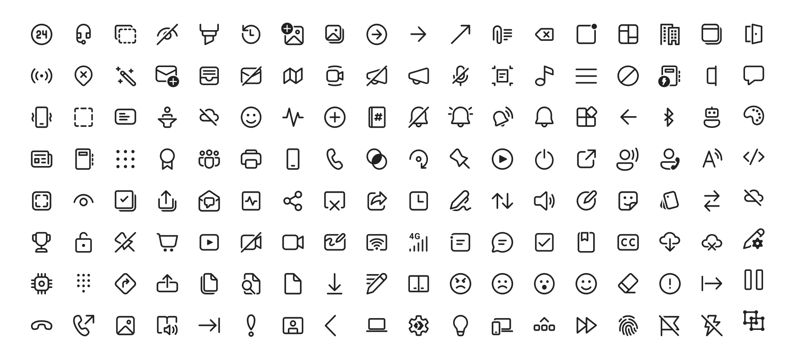

# Fluent UI System Icons

([中文](README.zh-cn.md)/**English**)

[Fluent UI System Icons](https://github.com/microsoft/fluentui-system-icons) are a collection of familiar, friendly and modern icons from Microsoft.

This project regenerates the icon library based on the icon files from [Fluent UI System Icons](https://github.com/microsoft/fluentui-system-icons). It is suitable for LCUI applications. For specific generation rules, please refer to the file: [scripts/convert.js](scripts/convert.js).



## Installation

```sh
npm install @lcui/react-icons
```

## Usage

To use these icons, you need to first import the CSS file in your root component file:

```tsx
// src/App.tsx

import '@lcui/react-icons/dist/style.css';
```

And then simply import them as `import { [IconName][Style] } from @lcui/react-icons.` For example:

```tsx
// src/MyComponent.tsx

import { AccessTime, AccessTimeFilled } from '@lcui/react-icons';
import styles from './MyCompoennt.module.css';

export default function MyComonent() {
  return (
    <div>
      <AccessTime className={styles.icon} size={24} />
      <AccessTimeFilled className={styles.icon} />
    </div>
  );
}
```

There are two styles of icons: Regular and Filled. Among them, Regular is the default style, which can be used as `AccessTime` without needing to write it as `AccessTimeRegular`.

If you don't like this usage, you can also use only the `Icon` component:

```tsx
// src/MyComponent.tsx

import { Icon } from '@lcui/react-icons';
import styles from './MyCompoennt.module.css';

export default function MyComonent() {
  return (
    <div>
      <Icon name="access-time" className={styles.icon} size={24} />
      <Icon name="access-time" className={styles.icon} filled />
    </div>
  );
}
```

If you don't like writing TypeScript React code, you can use it in C code:

```c
#include <LCUI.h>

...

int main(int argc, char **argv)
{
  ui_widget_t *icon;

  lcui_init();

  ui_load_css_file("FluentSystemIcons-Regular.css");
  ui_load_css_file("FluentSystemIcons-Filled.css");

  icon = ui_create_widget("text"):
  ui_widget_add_class(icon, "fui-icon-regular access-time-24-regular");
  ui_widget_set_style_unit_value(w, css_prop_font_size, 24, CSS_UNIT_PX)
  ui_root_append(icon);

  icon = ui_create_widget("text"):
  ui_widget_add_class(icon, "fui-icon-filled access-time-24-filled");
  ui_root_append(icon);

  return lcui_main();
}
```

Afterwards, manually copy the CSS and TTF files from the `node_modules/@lcui/react-icons/dist` directory to the application's working directory.

## Update

Download the latest source code package of [fluentui-system-icons](https://github.com/microsoft/fluentui-system-icons), extract it, and then run:

```sh
npm run build
```

## License

[MIT](./LICENSE)
